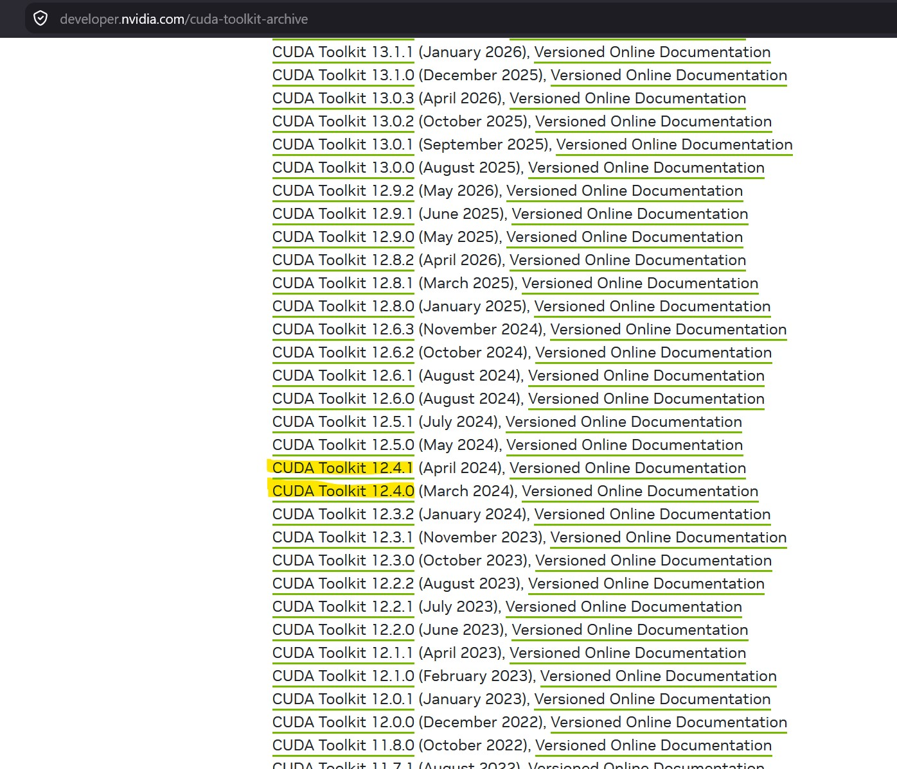
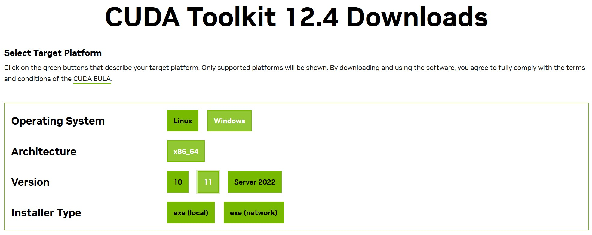
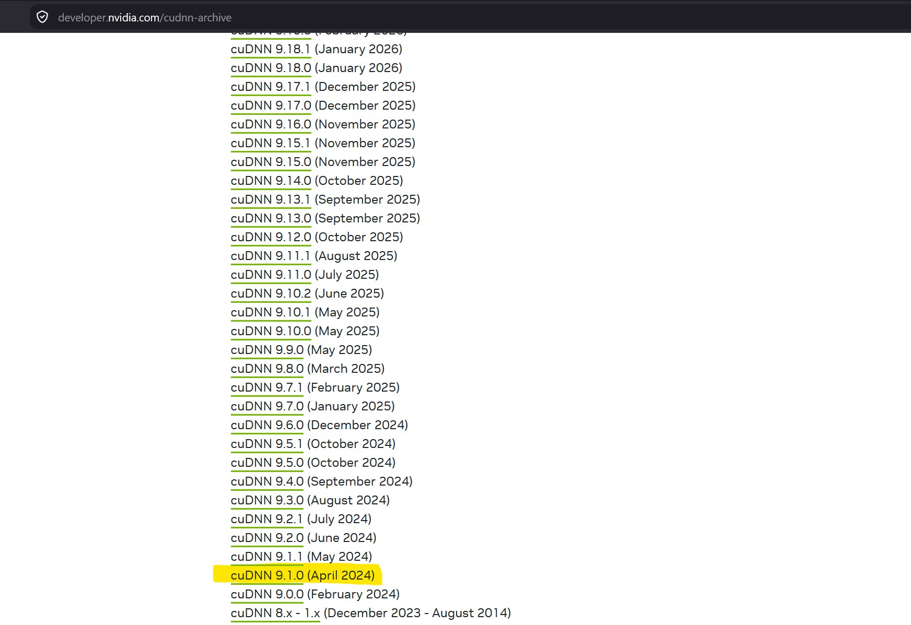
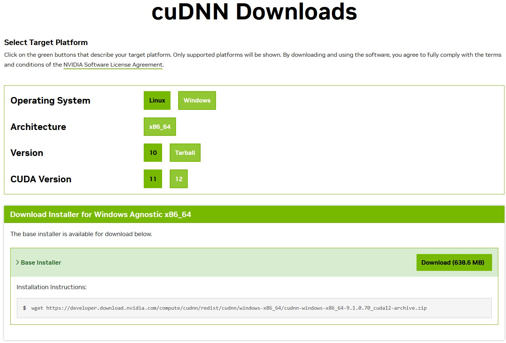

# Installing CUDA 12.4 + cuDNN for DJL/PyTorch on Windows

Notes from getting DJL's PyTorch engine (cu124 native) working on Windows with an RTX.

## Context - DJL versions used

```xml
<djl.version>0.36.0</djl.version>
<djl.native.version>2.5.1</djl.native.version>
```

`pom.xml` (DJL deps only):

```xml
<!-- Source: https://mvnrepository.com/artifact/ai.djl/api -->
<dependency>
  <groupId>ai.djl</groupId>
  <artifactId>api</artifactId>
  <version>${djl.version}</version>
  <scope>compile</scope>
</dependency>
<!-- Source: https://mvnrepository.com/artifact/ai.djl.pytorch/pytorch-engine -->
<dependency>
  <groupId>ai.djl.pytorch</groupId>
  <artifactId>pytorch-engine</artifactId>
  <version>${djl.version}</version>
  <scope>compile</scope>
</dependency>
<dependency>
  <groupId>ai.djl.pytorch</groupId>
  <artifactId>pytorch-native-cu124</artifactId>
  <classifier>win-x86_64</classifier>
  <version>${djl.native.version}</version>
</dependency>
<dependency>
  <groupId>ai.djl.pytorch</groupId>
  <artifactId>pytorch-jni</artifactId>
  <version>${djl.native.version}-${djl.version}</version>
</dependency>
```

`pytorch-native-cu124` pulls a PyTorch 2.5.1 build compiled against CUDA 12.4. This dictates every version choice below - the CUDA toolkit and cuDNN versions aren't a free choice, they need to match what this native artifact was built against.

## The concepts, quickly

- **NVIDIA driver** - kernel-level software that lets the OS talk to the GPU. `nvidia-smi` reads *this*, not any toolkit you've installed. It reports the maximum CUDA version the driver supports, which is why it kept showing 13.3 even after installing the 12.4 toolkit - installing/uninstalling the toolkit doesn't touch this number, only the driver itself does. Driver 13.3 is backward-compatible with a 12.4 runtime, so this was never the problem.
- **CUDA Toolkit (nvcc, libcudart, cuBLAS, etc.)** - the SDK: compiler (`nvcc`), runtime libraries, math primitives. This is the version PyTorch's native build is actually compiled against, and the one that has to match `pytorch-native-cu124` (i.e. 12.4).
- **cuDNN** - NVIDIA's deep-learning primitives library (convolutions, etc.), built on top of CUDA. **Not bundled with the CUDA Toolkit installer** - has to be downloaded separately and dropped manually into the toolkit folder. This was the actual missing piece.

## Step 1 - CUDA Toolkit 12.4

Download: https://developer.nvidia.com/cuda-12-4-0-download-archive?target_os=Windows&target_arch=x86_64&target_version=11&target_type=exe_local




Standard installer, nothing special to pick - installer defaults are fine.

Default install path:
```
C:\Program Files\NVIDIA GPU Computing Toolkit\CUDA\v12.4\
```

The installer also sets the `CUDA_PATH` env var automatically - no manual step needed here. Confirmed inside Java, via:
```
System.getenv("CUDA_PATH")
>>> C:\Program Files\NVIDIA GPU Computing Toolkit\CUDA\v12.4
```

Sanity check in a fresh terminal:
```
where cudart64_12.dll
```
Should resolve to `...\CUDA\v12.4\bin\cudart64_12.dll`. If it doesn't, the toolkit's `bin` folder isn't on `PATH` - open a new terminal (PATH changes need a fresh shell) or check the installer added it.

## Step 2 - cuDNN 9.1.0

Download: https://developer.nvidia.com/cudnn-archive




**Version matters here** - grabbed 9.1.0 specifically, not the latest release. PyTorch 2.5.1+cu124 is compiled/locked against cuDNN 9.1.x, so it's about matching what the native build expects, not "newest is best."

cuDNN ships as a zip, not an installer - copy its contents into the matching CUDA toolkit folders:

```
<extracted>\bin\*.dll      →  C:\Program Files\NVIDIA GPU Computing Toolkit\CUDA\v12.4\bin\
<extracted>\include\*.h    →  C:\Program Files\NVIDIA GPU Computing Toolkit\CUDA\v12.4\include\
<extracted>\lib\*.lib      →  C:\Program Files\NVIDIA GPU Computing Toolkit\CUDA\v12.4\lib\x64\
```

File names are distinct from the toolkit's own files, so nothing gets overwritten - just merges in.

Sanity check in a **fresh** terminal:
```
where cudnn64_9.dll
```
Should resolve to `...\CUDA\v12.4\bin\cudnn64_9.dll`.

## Problem hit + fix

**Error:**
```
java.lang.UnsatisfiedLinkError: C:\Users\UserName\.djl.ai\pytorch\2.5.1-20241113-cu124-win-x86_64\torch_cuda.dll: Can't find dependent libraries
```

The DLL itself existed on disk (confirmed with `Files.exists`) - the error is Windows failing to resolve `torch_cuda.dll`'s *own* dependencies, not the file being missing.

**Root cause:** cuDNN wasn't installed. It's not bundled with the CUDA Toolkit installer, so `torch_cuda.dll` couldn't find `cudnn64_9.dll` anywhere on the search path.

**Fix:** installed cuDNN 9.1.0 and copied `bin`/`include`/`lib` into the CUDA 12.4 toolkit folder as above. Confirmed with `where cudnn64_9.dll` in a new terminal, then reran the Java project - worked.

**If this happens again and cuDNN checks out fine:** use the [Dependencies tool](https://github.com/lucasg/Dependencies) directly against `torch_cuda.dll` to see exactly which dependency is unresolved rather than guessing - VC++ Redistributable (x64) is the next most likely candidate.

**Possible output after success:**

``
22:12:07.144 [main] DEBUG ai.djl.engine.Engine - Registering EngineProvider: RPC
22:12:07.147 [main] DEBUG ai.djl.engine.Engine - Registering EngineProvider: PyTorch
22:12:07.148 [main] DEBUG ai.djl.engine.Engine - Found default engine: PyTorch
22:12:41.341 [main] INFO  ai.djl.util.Platform - Found matching platform from: jar:file:/C:/Users/UserName/.m2/repository/ai/djl/pytorch/pytorch-native-cu124/2.5.1/pytorch-native-cu124-2.5.1-win-x86_64.jar!/native/lib/pytorch.properties
22:12:41.342 [main] DEBUG ai.djl.pytorch.jni.LibUtils - Found bundled PyTorch package: cu124-win-x86_64:2.5.1-20241113.
22:12:41.344 [main] DEBUG ai.djl.pytorch.jni.LibUtils - Using cache dir: C:\Users\UserName\.djl.ai\pytorch
22:12:41.356 [main] DEBUG ai.djl.pytorch.jni.LibUtils - Loading native library: C:\Users\UserName\.djl.ai\pytorch\2.5.1-20241113-cu124-win-x86_64\asmjit.dll
22:12:41.358 [main] DEBUG ai.djl.pytorch.jni.LibUtils - Loading native library: C:\Users\UserName\.djl.ai\pytorch\2.5.1-20241113-cu124-win-x86_64\c10.dll
22:12:41.359 [main] DEBUG ai.djl.pytorch.jni.LibUtils - Loading native library: C:\Users\UserName\.djl.ai\pytorch\2.5.1-20241113-cu124-win-x86_64\cublas64_12.dll
22:12:41.418 [main] DEBUG ai.djl.pytorch.jni.LibUtils - Loading native library: C:\Users\UserName\.djl.ai\pytorch\2.5.1-20241113-cu124-win-x86_64\cublasLt64_12.dll
22:12:41.476 [main] DEBUG ai.djl.pytorch.jni.LibUtils - Loading native library: C:\Users\UserName\.djl.ai\pytorch\2.5.1-20241113-cu124-win-x86_64\cudart64_12.dll
22:12:41.478 [main] DEBUG ai.djl.pytorch.jni.LibUtils - Loading native library: C:\Users\UserName\.djl.ai\pytorch\2.5.1-20241113-cu124-win-x86_64\cufft64_11.dll
22:12:41.484 [main] DEBUG ai.djl.pytorch.jni.LibUtils - Loading native library: C:\Users\UserName\.djl.ai\pytorch\2.5.1-20241113-cu124-win-x86_64\cufftw64_11.dll
22:12:41.485 [main] DEBUG ai.djl.pytorch.jni.LibUtils - Loading native library: C:\Users\UserName\.djl.ai\pytorch\2.5.1-20241113-cu124-win-x86_64\cupti64_2024.1.0.dll
22:12:41.488 [main] DEBUG ai.djl.pytorch.jni.LibUtils - Loading native library: C:\Users\UserName\.djl.ai\pytorch\2.5.1-20241113-cu124-win-x86_64\curand64_10.dll
22:12:41.490 [main] DEBUG ai.djl.pytorch.jni.LibUtils - Loading native library: C:\Users\UserName\.djl.ai\pytorch\2.5.1-20241113-cu124-win-x86_64\cusolver64_11.dll
22:12:41.497 [main] DEBUG ai.djl.pytorch.jni.LibUtils - Loading native library: C:\Users\UserName\.djl.ai\pytorch\2.5.1-20241113-cu124-win-x86_64\cusolverMg64_11.dll
22:12:41.499 [main] DEBUG ai.djl.pytorch.jni.LibUtils - Loading native library: C:\Users\UserName\.djl.ai\pytorch\2.5.1-20241113-cu124-win-x86_64\cusparse64_12.dll
22:12:41.502 [main] DEBUG ai.djl.pytorch.jni.LibUtils - Loading native library: C:\Users\UserName\.djl.ai\pytorch\2.5.1-20241113-cu124-win-x86_64\libiomp5md.dll
22:12:41.504 [main] DEBUG ai.djl.pytorch.jni.LibUtils - Loading native library: C:\Users\UserName\.djl.ai\pytorch\2.5.1-20241113-cu124-win-x86_64\libiompstubs5md.dll
22:12:41.505 [main] DEBUG ai.djl.pytorch.jni.LibUtils - Loading native library: C:\Users\UserName\.djl.ai\pytorch\2.5.1-20241113-cu124-win-x86_64\nvJitLink_120_0.dll
22:12:41.507 [main] DEBUG ai.djl.pytorch.jni.LibUtils - Loading native library: C:\Users\UserName\.djl.ai\pytorch\2.5.1-20241113-cu124-win-x86_64\nvrtc-builtins64_124.dll
22:12:41.508 [main] DEBUG ai.djl.pytorch.jni.LibUtils - Loading native library: C:\Users\UserName\.djl.ai\pytorch\2.5.1-20241113-cu124-win-x86_64\nvrtc64_120_0.dll
22:12:41.511 [main] DEBUG ai.djl.pytorch.jni.LibUtils - Loading native library: C:\Users\UserName\.djl.ai\pytorch\2.5.1-20241113-cu124-win-x86_64\nvToolsExt64_1.dll
22:12:41.512 [main] DEBUG ai.djl.pytorch.jni.LibUtils - Loading native library: C:\Users\UserName\.djl.ai\pytorch\2.5.1-20241113-cu124-win-x86_64\uv.dll
22:12:41.513 [main] DEBUG ai.djl.pytorch.jni.LibUtils - Loading native library: C:\Users\UserName\.djl.ai\pytorch\2.5.1-20241113-cu124-win-x86_64\zlibwapi.dll
22:12:41.515 [main] DEBUG ai.djl.pytorch.jni.LibUtils - Loading native library: C:\Users\UserName\.djl.ai\pytorch\2.5.1-20241113-cu124-win-x86_64\fbgemm.dll
22:12:41.517 [main] DEBUG ai.djl.pytorch.jni.LibUtils - Loading native library: C:\Users\UserName\.djl.ai\pytorch\2.5.1-20241113-cu124-win-x86_64\caffe2_nvrtc.dll
22:12:41.518 [main] DEBUG ai.djl.pytorch.jni.LibUtils - Loading native library: C:\Users\UserName\.djl.ai\pytorch\2.5.1-20241113-cu124-win-x86_64\torch_cpu.dll
22:12:41.705 [main] DEBUG ai.djl.pytorch.jni.LibUtils - Loading native library: C:\Users\UserName\.djl.ai\pytorch\2.5.1-20241113-cu124-win-x86_64\c10_cuda.dll
22:12:41.707 [main] DEBUG ai.djl.pytorch.jni.LibUtils - Loading native library: C:\Users\UserName\.djl.ai\pytorch\2.5.1-20241113-cu124-win-x86_64\torch_cuda.dll
22:12:41.727 [main] DEBUG ai.djl.pytorch.jni.LibUtils - Loading native library: C:\Users\UserName\.djl.ai\pytorch\2.5.1-20241113-cu124-win-x86_64\torch.dll
22:26:19.895 [main] DEBUG ai.djl.pytorch.jni.LibUtils - Loading native library: C:\Users\UserName\.djl.ai\pytorch\2.5.1-20241113-cu124-win-x86_64\0.36.0-djl_torch.dll
22:26:20.735 [main] INFO  ai.djl.pytorch.engine.PtEngine - PyTorch graph executor optimizer is enabled, this may impact your inference latency and throughput. See: https://docs.djl.ai/master/docs/development/inference_performance_optimization.html#graph-executor-optimization
22:26:20.743 [main] INFO  ai.djl.pytorch.engine.PtEngine - Number of inter-op threads is 12
22:26:20.743 [main] INFO  ai.djl.pytorch.engine.PtEngine - Number of intra-op threads is 12
``
