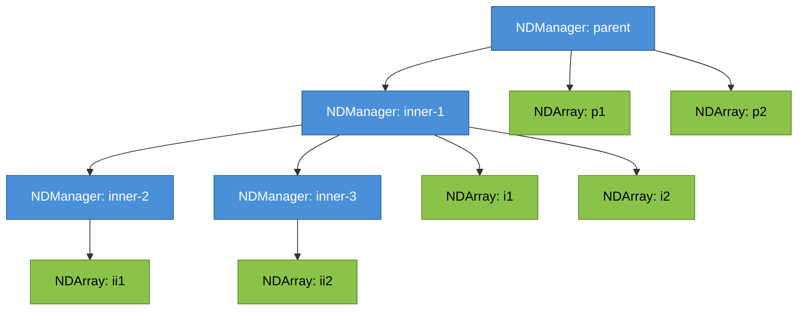
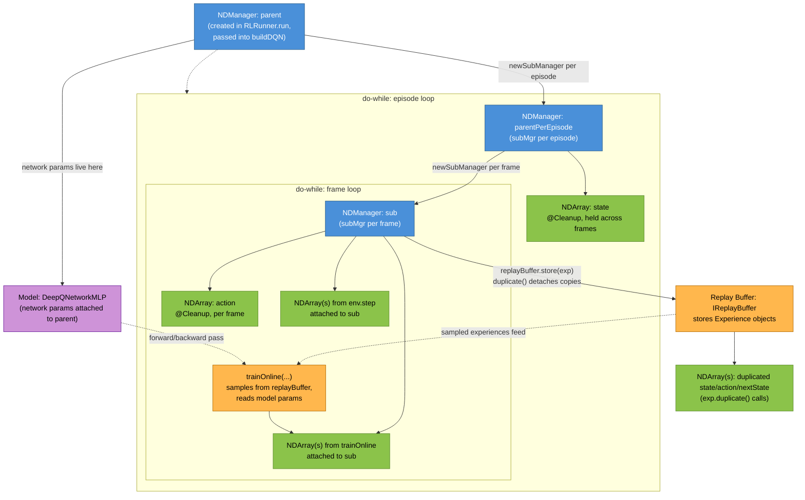
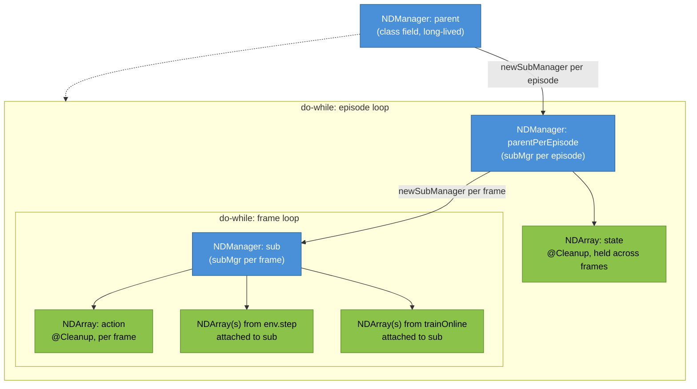

Memory Management DJL example:

```mermaid
graph TD
    parent["NDManager: parent"]
    inner1["NDManager: inner-1"]
    inner2["NDManager: inner-2"]
    inner3["NDManager: inner-3"]

    p1["NDArray: p1"]
    p2["NDArray: p2"]
    i1["NDArray: i1"]
    i2["NDArray: i2"]
    ii1["NDArray: ii1"]
    ii2["NDArray: ii2"]

    parent --> p1
    parent --> p2
    parent --> inner1

    inner1 --> i1
    inner1 --> i2
    inner1 --> inner2
    inner1 --> inner3

    inner2 --> ii1
    inner3 --> ii2

    classDef manager fill:#4A90D9,stroke:#2C5F8A,color:#fff
    classDef array fill:#8BC34A,stroke:#5A8A2C,color:#000
    class parent,inner1,inner2,inner3 manager
    class p1,p2,i1,i2,ii1,ii2 array
```

Memory Management of the project java-rl-dqn-to-rainbow:

```mermaid
graph TD
    parent["NDManager: parent<br/>(created in RLRunner.run,<br/>passed into buildDQN)"]
    model["Model: DeepQNetworkMLP<br/>(network params attached to parent)"]
    ppe["NDManager: parentPerEpisode<br/>(subMgr per episode)"]
    sub["NDManager: sub<br/>(subMgr per frame)"]

    state["NDArray: state<br/>@Cleanup, held across frames"]
    action["NDArray: action<br/>@Cleanup, per frame"]
    stepArrs["NDArray(s) from env.step<br/>attached to sub"]
    trainArrs["NDArray(s) from trainOnline<br/>attached to sub"]

    replayBuffer["Replay Buffer: IReplayBuffer<br/>stores Experience objects"]
    expArrs["NDArray(s): duplicated state/action/nextState<br/>(exp.duplicate() calls)"]

    parent -->|"network params live here"| model
    parent -->|"newSubManager per episode"| ppe
    ppe -->|"newSubManager per frame"| sub

    ppe --> state
    sub --> action
    sub --> stepArrs
    sub --> trainArrs

    sub -->|"replayBuffer.store(exp)<br/>duplicate() detaches copies"| replayBuffer
    replayBuffer --> expArrs

    trainOnline["trainOnline(...)<br/>samples from replayBuffer,<br/>reads model params"] 
    replayBuffer -.->|"sampled experiences feed"| trainOnline
    model -.->|"forward/backward pass"| trainOnline
    trainOnline --> trainArrs

    subgraph episodeLoop [do-while: episode loop]
        ppe
        state
        subgraph frameLoop [do-while: frame loop]
            sub
            action
            stepArrs
            trainArrs
            trainOnline
        end
    end

    parent -.-> episodeLoop

    classDef manager fill:#4A90D9,stroke:#2C5F8A,color:#fff
    classDef array fill:#8BC34A,stroke:#5A8A2C,color:#000
    classDef buffer fill:#FFB74D,stroke:#B26A00,color:#000
    classDef modelNode fill:#CE93D8,stroke:#6A1B9A,color:#000
    class parent,ppe,sub manager
    class state,action,stepArrs,trainArrs,expArrs array
    class replayBuffer,trainOnline buffer
    class model modelNode
```

Memory Management of the project java-rl-dqn-to-rainbow (AbstractAgent loop):

```mermaid
graph TD
parent["NDManager: parent<br/>(class field, long-lived)"]
    ppe["NDManager: parentPerEpisode<br/>(subMgr per episode)"]
    sub["NDManager: sub<br/>(subMgr per frame)"]

    state["NDArray: state<br/>@Cleanup, held across frames"]
    action["NDArray: action<br/>@Cleanup, per frame"]
    stepArrs["NDArray(s) from env.step<br/>attached to sub"]
    trainArrs["NDArray(s) from trainOnline<br/>attached to sub"]

    parent -->|"newSubManager per episode"| ppe
    ppe -->|"newSubManager per frame"| sub

    ppe --> state
    sub --> action
    sub --> stepArrs
    sub --> trainArrs

    subgraph episodeLoop [do-while: episode loop]
        ppe
        state
        subgraph frameLoop [do-while: frame loop]
            sub
            action
            stepArrs
            trainArrs
        end
    end

    parent -.-> episodeLoop

    classDef manager fill:#4A90D9,stroke:#2C5F8A,color:#fff
    classDef array fill:#8BC34A,stroke:#5A8A2C,color:#000
    class parent,ppe,sub manager
    class state,action,stepArrs,trainArrs array
```